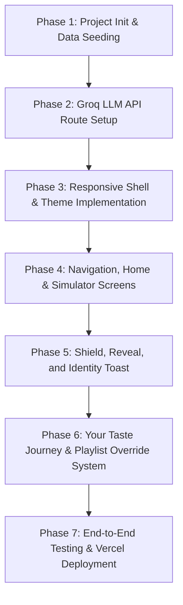

# Spotify TrueTune MVP — Software Architecture Document

This document outlines the system architecture, component design, data flow, and phase-wise implementation plan for **TrueTune**, an AI-powered taste protection and discovery feature integrated into a Spotify mobile-style web application shell.

---

## 1. System Overview & Architecture Diagram

TrueTune is a client-server web application built using **Next.js (App Router)** and styled with **Vanilla CSS** inside a centered phone-frame container to mimic Spotify’s mobile experience. The core of the application relies on an LLM-based classifier powered by the **Groq API** to determine if a listening session is "functional" (background/focus) or "identity" (active music exploration).

### High-Level Architecture

```mermaid
graph TD
    subgraph Client [Client-Side (React/Next.js)]
        UI[Phone Container ~390px] --> Nav[Bottom Nav / Routing]
        UI --> State[In-Memory State & Overrides]
        
        subgraph Screens
            S1[Screen 1: Spotify Home]
            S2[Screen 2: Simulate Session]
            S3[Screen 3: Now Playing]
            S4[Screen 4: Shield Card Sheet]
            S5[Screen 5: Reveal Card Sheet]
            S6[Screen 6: Your Taste Journey]
            S7[Screen 7: Your Library - Playlists & Overrides]
            S8[Screen 8: Search Screen]
            S9[Screen 9: Identity Toast Overlay]
        end

        Nav --> Screens
        S2 -->|Start Simulation| S3
        S3 -->|If Functional| S4
        S3 -->|If Identity| S9
        S4 -->|Dismiss Shield| S5
    end

    subgraph Server [Server-Side (Next.js API Route)]
        API[API Endpoint: /api/classify]
        PromptBuilder[Prompt Builder]
    end

    subgraph LLM [Groq AI Engine]
        Groq[llama-3.3-70b-versatile]
    end

    S3 -->|Submit Session Signals if Auto| API
    API --> PromptBuilder
    PromptBuilder -->|JSON Request| Groq
    Groq -->|Strict JSON Response| API
    API -->|Classification + Reasoning| S3
    
    State -->|Track Stats & Badges| S6
    State -->|Apply Overrides| S3
```

---

## 2. Core Modules & Component Design

### 2.1. In-Memory State & Data Layer (`seed_data.json`)
The application uses the exact seeded dataset specified in `TrueTune_UI_and_Data_Spec.md` combined with dynamic in-memory states:
*   **`library`**: Tracks split into `functional_only` (high play count lo-fi, workout tracks) and `protected` (user's true taste: indie rock, carnatic fusion, ghazal fusion, etc.).
*   **`sessions`**: Represents the 5 simulation scenarios (`s01` to `s05`), containing behavioral signals.
*   **`playlist_overrides`**: In-memory JS state keyed by playlist name tracking user overrides (`"auto" | "force_functional" | "force_identity"`) and last classification outcomes.
*   **`session_history`**: Tracks stats in-memory: `functional_sessions_protected` (counter) and `reveal_saves` (array of saved Reveal tracks).

### 2.2. Server-Side Classification API (`/api/classify`)
To secure the `GROQ_API_KEY`, classification runs in a Next.js serverless route. It translates session signals into a structured LLM prompt and parses the LLM output.
*   **Model**: `llama-3.3-70b-versatile`
*   **Expected JSON Format**:
    ```json
    {
      "classification": "functional" | "identity",
      "confidence": 0.0 - 1.0,
      "reasoning": ["signal 1", "signal 2", "signal 3"]
    }
    ```
*   **Override Check**: If a playlist's override state is set to a forced value, the frontend bypasses calling this API and applies the result directly.

### 2.3. Frontend App Shell & Responsive Layout
*   **Spotify Phone Frame**: A centered container constrained to `390px` width, with rounded corners (`40px`), a dark theme (`#121212` main background, `#000000` accents), and a subtle drop shadow.
*   **Disclaimer Component**: Present at the bottom of the phone screen on *every* view:
    > *"This is a non-commercial student concept demo of a hypothetical Spotify feature (TrueTune) and is not affiliated with, endorsed by, or produced by Spotify."*
*   **Status Bar**: Renders a mockup mobile status bar (Time, Battery, Wifi, Cellular signal) at the top of Home, Simulation, Taste Journey, and Library screens.
*   **Navigation Tab Bar**: A 4-icon bottom nav (Home, Simulate, Taste Journey, Your Library) displayed on all main views except during active Now Playing playbacks, the Identity Toast, or bottom-sheet overlays.

---

## 3. Detailed UI Screen Blueprint

Based on the 6 design screenshots in `/design`:

| Screen # | Screen Name | Layout Details | Dynamic Interactions & Logic |
| :--- | :--- | :--- | :--- |
| **1** | **Home** | Real Spotify-like status bar, profile avatar circle (A) next to quick filters (All, Music, Podcasts) inline at the top. Horizontal carousels for "Recommended Stations", "Recents", and "Your top mixes". | Profile Avatar Circle (A) and quick filters are rendered on the same horizontal row. Tapping playlist cards shows status badges. |
| **2** | **Simulate Session** | Vertical stack of the 5 seeded scenario cards (`s01` - `s05`) with icons and descriptive subtitle labels. | Tapping a card initiates the simulated playback flow. |
| **3** | **Now Playing** | Full-screen visual audio player. Album art, active track titles, seek bar, playback controls, and a status badge pill near the top. | Animates/cycles through the session's track list. On completion, checks overrides. |
| **4** | **Shield Card** | Bottom sheet overlay with slide-up transition. Displays shield icon, confidence badge, and signal list. | Dismissing shield immediately triggers the Reveal Card overlay. |
| **5** | **Reveal Card** | Bottom sheet overlay with a row of tag chips, one recommended track, Play / Save buttons, and Skip. | Saving track adds to `reveal_saves` and updates Taste Journey statistics. |
| **6** | **Your Taste Journey** | Stats dashboard tracking "X focus sessions protected" and "Y new artists discovered", followed by "Your Growing Genres" tag cloud. | Stats and tag cloud are computed from in-memory state. |
| **7** | **Your Library (Playlists & Artists)** | Interactive tabs for Playlists, Saved Discovery, and Artists. The Playlists tab renders playlist items with a "•••" override menu. The Artists tab renders the list of discovered artists dynamically. | Tapping tabs changes view. The "Artists" tab lists all unique artist names derived from `reveal_saves` with a "Discovered via TrueTune" tag. |
| **8** | **Search Screen** | Modern search screen displaying a search query input container and a grid of colorful genre/category tiles (Podcasts, Pop, Hip-Hop, etc.). | Accessed via the magnifying glass icon at the end of the bottom navigation bar. |
| **9** | **Identity Toast** | Lightweight notification banner appearing near the top of the Now Playing screen below the status bar, featuring a leaf/sparkle icon. | Appears when a session is classified/overridden as `"identity"`. Auto-dismisses after 3 seconds. |

---

## 4. Phase-Wise Implementation Plan



### Phase 1: Initialization & Seed Data Setup
1.  Verify the environment and check Next.js CLI flags.
2.  Initialize the Next.js application using Vanilla CSS. Set up package dependencies (e.g. `lucide-react` for Spotify-styled icons).
3.  Write the seeded library and sessions into `src/data/seed_data.json`.
4.  Configure environment variables in `.env.local` (`GROQ_API_KEY`).

### Phase 2: Classification API Endpoint (`/api/classify`)
1.  Implement the classification POST endpoint `/api/classify` or `/app/api/classify/route.js`.
2.  Write the prompt engineering helper. The prompt will supply the LLM with the session's specific behavioral telemetry: skip rate, repeat rate, playlist title, duration, time of day, and genre diversity.
3.  Instruct the model to classify the session as `functional` or `identity` and return a strict JSON output matching our interface.
4.  Verify functionality by writing a lightweight test runner script to simulate sending the 5 scenarios directly to the local API endpoint.

### Phase 3: Responsive Frame & Core Styling
1.  Create `globals.css` with Spotify's color system:
    *   `--bg-main`: `#121212`
    *   `--bg-black`: `#000000`
    *   `--spotify-green`: `#1DB954`
    *   `--text-primary`: `#FFFFFF`
    *   `--text-muted`: `#B3B3B3`
2.  Design a responsive container structure: a viewport-centered box fixed to `390px` width and `844px` height (representing an iPhone 13/14 aspect ratio) with `border-radius: 40px`, a dark bezel border, and a status bar mockup.
3.  Integrate the persistent student concept disclaimer at the footer of the layout frame.

### Phase 4: Navigation, Home, Simulate & Now Playing Playback
1.  Implement client-side state for routing/view switching.
2.  Build the **Home Screen** (Screen 1) layout with mock lists representing recent streams and personalized stations.
3.  Build the **Simulate Screen** (Screen 2) pulling cards directly from the seeded session configurations.
4.  Build the **Now Playing Screen** (Screen 3). When a session is selected, enter this screen, load the session's tracks, and animate the progress bar and active album art, cycling through the tracklist list sequentially.

### Phase 5: Shield, Reveal, and Identity Toast
1.  Create the **Shield Card Sheet** (Screen 4). When Now Playing cycles finish, determine classification (call API or use override). If functional, dim the Now Playing screen, disable player controls, and slide up the Shield sheet containing the confidence rating and reasons.
2.  Create the **Reveal Card Sheet** (Screen 5). Upon dismissing the Shield, slide up the Reveal sheet:
    *   Build filter chips dynamically from the `protected` library pool.
    *   Select recommendations using a weighted-random selection from the protected list.
    *   Handle chip selection, Skip (re-roll), and Save (tracks pushed to `reveal_saves`).
3.  Create the **Identity Session Toast** (Screen 7). If classification is identity, display a non-blocking top toast for 3 seconds, then return to the simulator screen.

### Phase 6: Your Taste Journey & Playlist Override System
1.  Build the **Your Taste Journey Screen** (Screen 6) containing two main stat counters ("focus sessions protected", "new artists discovered") and the "Growing Genres" tag cloud. Compute values dynamically from `session_history` state.
2.  Build the **Playlist Library & Override Menu** (Screen 8) inside the Your Library view.
3.  Add status badges to Now Playing and Playlist Cards based on the `playlist_overrides` state.
4.  Implement the popover menu for the "•••" buttons to enable Auto-detect, Always treat as functional, or Always treat as identity-driven. Integrate this state with the playback completion step to bypass Groq calls when an override is present.

### Phase 7: Edge Cases, Testing & Deployment
1.  Validate **Scenario s05 (Borderline case)**: The LLM should yield a mid-range confidence rating (~50-70%) with nuanced signals to demonstrate the benefit of LLM classification when set to "Auto-detect".
2.  Validate filter chip changes: Selecting "dream pop" or "indie hindi" on the Reveal card restricts choices to tracks within that genre/mood.
3.  Verify that forced overrides immediately bypass the API call, trigger the correct UI directly, and update badges correctly.
4.  Deploy the Next.js production build to Vercel and input the `GROQ_API_KEY` environmental variable.

---

## 5. Verification Checklist & Success Criteria

- [ ] Next.js project runs without compilation errors.
- [ ] Groq API endpoint is protected server-side and responds with structured JSON.
- [ ] Under s05, classification runs successfully and shows an explanation.
- [ ] Recommendations are restricted strictly to the user's `protected` library pool (`t005`-`t012`, `t019`-`t022`).
- [ ] Skip re-selects a different track without showing the skipped track.
- [ ] Save interactions add tracks to `reveal_saves`, updating the Your Taste Journey stats (protected sessions count, unique artists, and growing genres cloud).
- [ ] Identity sessions correctly display the temporary top toast rather than the Shield overlay, and do not show progress indicators after completion.
- [ ] Playlist overrides ("Always functional" / "Always identity") skip the Groq API call entirely and execute the correct flow immediately.
- [ ] Playlist status badges are updated and displayed on Now Playing and Playlist cards.
- [ ] Vercel public URL is generated and fully functional.
